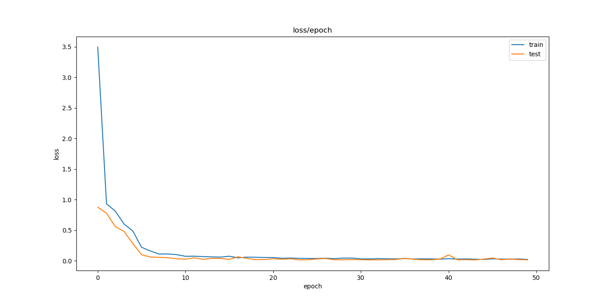

# Распознавание рукописных символов

Студент гр. 7381 Минуллин М.А.
Преподаватель Жукова Н.А.

## Цель работы 

Реализовать классификацию черно-белых изображений рукописных цифр (28x28) по 10 категориям (от 0 до 9).


Набор данных содержит 60,000 изображений для обучения и 10,000 изображений для тестирования. 

## Задачи

- Ознакомиться с представлением графических данных;
- Ознакомиться с простейшим способом передачи графических данных нейронной сети;
- Создать модель;
- Настроить параметры обучения;
- Написать функцию, позволяющая загружать изображение пользователи и классифицировать его;

## Требования

1. Найти архитектуру сети, при которой точность классификации будет не менее 95%;
2. Исследовать влияние различных оптимизаторов, а также их параметров, на процесс обучения;
3. Написать функцию, которая позволит загружать пользовательское изображение не из датасета.

## Ход работы

### Выбранная архитектура

Предложенная по умолчанию архитектура в данной лабораторной работе даёт точность выше 95%, поэтому оставим её без изменений. 

```python
model = Sequential()
model.add(Flatten())
model.add(Dense(256, activation='relu'))
model.add(Dense(10, activation='softmax'))
```

В архитектуре сети имеется 4 слоя:

- входной, заданный неявно при вызове конструктора `Sequential`;
- Flatten, преобразующий входное двумерное изображение в одномерный вектор;
- скрытый слой (256 нейронов);
- выходной слой, рассчитывающий вероятности принадлежности к каждому из 10 классов цифр.

### Влияние оптимизаторов

Были опробованы все оптимизаторы, найденные на страничке [optimizers](https://keras.io/optimizers/):

- adam;
- nadam;
- rmsprop;
- sgd; 
- adamax;
- adagrad.

Для выбранной архитектуры были произведены запуски по очереди с каждым оптимизатором. 

Точность для всех оптимизаторов:


Потери для всех оптимизаторов:


С поставленной задачей в точность выше 95% справились все выбранные оптимизаторы, кроме adagrad и sgd.

### Использование пользовательского изображения

Найти цифру на пользовательском изображении с помощью обученной модели можно следующим образом:

```python
from PIL import Image
import numpy as np

def predict_image(model, image):
    return model.predict((np.asarray(
      Image.open(image).convert('L')
      .resize((28, 28))) / 255.0)[np.newaxis, :, :])

```

Для пробного запуска обучим модель с оптимизатором adam. В качестве тестовой картинки нарисуем свою собственную: 

Посмотрим, что предскажет обученная нейросеть:

```python
print(predict_image(model, '5.png'))
```
Результат:
```
[[
  2.0446742e-03 9.4643561e-04 8.7960643e-06 5.3254222e-03 
  5.9505455e-06 9.8998028e-01 1.5184734e-03 5.5735953e-05
  6.3830688e-05 5.0410898e-05
]]
```
Здесь нас интересует значение 9.8998028e-01 из второй строчки. Оно соответствует тому, что вероятность того, что на использованном изображении изображения пятёрка равно 99%

## Выводы

В ходе выполнения данной работы была изучена задача регрессии.

